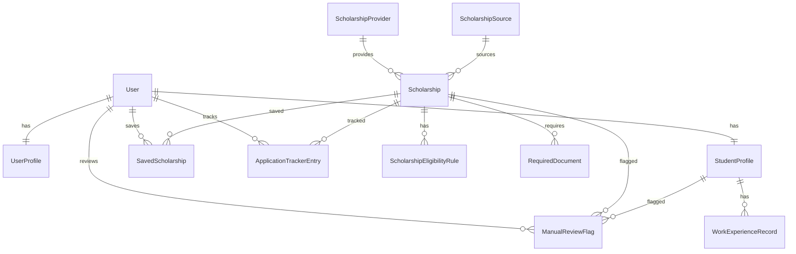

# ScholarFind ER Diagram

```mermaid
erDiagram
    User ||--|| UserProfile : has
    User ||--|| StudentProfile : has
    User ||--o{ SavedScholarship : saves
    User ||--o{ ApplicationTrackerEntry : tracks
    User ||--o{ ManualReviewFlag : reviews

    ScholarshipProvider ||--o{ Scholarship : provides
    ScholarshipSource ||--o{ Scholarship : sources
    Scholarship ||--o{ ScholarshipEligibilityRule : has
    Scholarship ||--o{ RequiredDocument : requires
    Scholarship ||--o{ SavedScholarship : saved
    Scholarship ||--o{ ApplicationTrackerEntry : tracked
    Scholarship ||--o{ ManualReviewFlag : flagged

    StudentProfile ||--o{ ManualReviewFlag : flagged
    StudentProfile ||--o{ WorkExperienceRecord : has
```